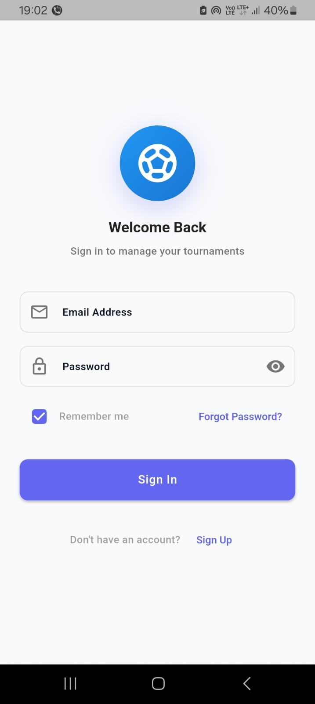
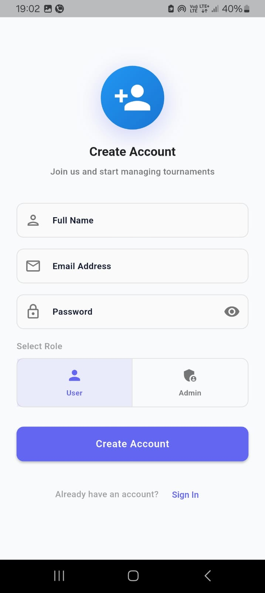

# 🏆 ArenaFlow - Tournament Management System

<div align="center">


**A comprehensive Flutter application for managing sports tournaments, teams, players, and live matches with real-time updates.**

[Features](#-features) • [Screenshots](#-screenshots) • [Installation](#-installation) • [Architecture](#-architecture) • [Usage](#-usage)

</div>

---

## 📋 Table of Contents

- [Overview](#-overview)
- [Features](#-features)
- [Screenshots](#-screenshots)
- [Tech Stack](#-tech-stack)
- [Architecture](#-architecture)
- [Project Structure](#-project-structure)
- [Installation](#-installation)
- [Firebase Setup](#-firebase-setup)
- [Usage](#-usage)
- [API Reference](#-api-reference)
- [Contributing](#-contributing)
- [License](#-license)

---

## 🌟 Overview

**ArenaFlow** is a modern, feature-rich tournament management system built with Flutter and Firebase. It provides a complete solution for organizing sports events, managing teams and players, scheduling matches, and tracking live scores in real-time. Whether you're organizing a small local tournament or managing multiple sporting events, ArenaFlow streamlines the entire process with an intuitive interface and powerful features.

### Why ArenaFlow?

- 🎯 **All-in-One Solution**: Manage tournaments, teams, players, and matches from a single platform
- ⚡ **Real-Time Updates**: Live score updates and match status changes synchronized across all devices
- 🏗️ **Scalable Architecture**: Built with BLoC pattern and clean architecture principles
- 🎨 **Modern UI/UX**: Beautiful, responsive design with smooth animations
- 🔐 **Role-Based Access**: Separate interfaces for admins and users with proper authentication
- 📊 **Comprehensive Analytics**: Track player statistics, team performance, and tournament progress

---

## ✨ Features

### 🔐 Authentication & Authorization
- ✅ Email/Password authentication with Firebase Auth
- ✅ User registration with role selection (Admin/User)
- ✅ Secure login with "Remember Me" functionality
- ✅ Password reset via email
- ✅ Role-based access control (RBAC)
- ✅ Persistent authentication state

### 👥 User Management
- ✅ User profile management
- ✅ Admin dashboard with full control
- ✅ User dashboard with personalized view
- ✅ Role-based navigation

### ⚽ Team Management
- ✅ Create and manage multiple teams
- ✅ Sport-specific team organization (Football, Cricket, Basketball, Volleyball)
- ✅ Team roster management
- ✅ Player count tracking
- ✅ Team search and filtering

### 👤 Player Management
- ✅ Add players with detailed profiles
- ✅ Jersey number and position assignment
- ✅ Player statistics tracking
- ✅ Contact information management
- ✅ Physical attributes (height, weight)
- ✅ Experience level tracking

### 🏆 Tournament System
- ✅ Create tournaments with multiple formats:
  - Single Elimination
  - Double Elimination
  - Round Robin
- ✅ Tournament registration phase
- ✅ Bracket generation and visualization
- ✅ Standings and leaderboards
- ✅ Tournament progress tracking
- ✅ Team registration management

### 🎮 Match Management
- ✅ Schedule matches with venue and time
- ✅ Live match tracking with real-time updates
- ✅ Score updates for both teams
- ✅ Match status management (Scheduled/Live/Completed/Cancelled)
- ✅ Match details and history
- ✅ Commentary system for live matches
- ✅ Match filtering (All/Live/Scheduled)

### 📊 Statistics & Analytics
- ✅ Player performance tracking
- ✅ Team statistics
- ✅ Match history
- ✅ Tournament standings
- ✅ Real-time score updates

### 🎨 UI/UX Features
- ✅ Modern, clean interface with Material Design
- ✅ Smooth animations and transitions
- ✅ Dark/Light theme support
- ✅ Responsive layouts for different screen sizes
- ✅ Loading states with shimmer effects
- ✅ Empty state illustrations
- ✅ Error handling with user-friendly messages
- ✅ Status badges with color coding
- ✅ Gradient backgrounds and cards

---

## 📱 Screenshots

<div align="center">

<table>
  <tr>
    <td align="center" width="33%">
      <br/>
      <b>Login</b><br/>
      <sub>Secure login with remember me</sub>
    </td>
    <td align="center" width="33%">
      <br/>
      <b>Sign Up</b><br/>
      <sub>User registration with role selection</sub>
    </td>
    <td align="center" width="33%">
      <br/>
      <b>Admin Dashboard</b><br/>
      <sub>Comprehensive admin panel</sub>
    </td>
  </tr>
  <tr>
    <td align="center">
      <br/>
      <b>Team Management</b><br/>
      <sub>Manage teams across sports</sub>
    </td>
    <td align="center">
      <br/>
      <b>Adding New Player</b><br/>
      <sub>Add players with details</sub>
    </td>
    <td align="center">
      <br/>
      <b>Player Details</b><br/>
      <sub>Detailed player profiles</sub>
    </td>
  </tr>
  <tr>
    <td align="center">
      <br/>
      <b>Creating Tournament</b><br/>
      <sub>Set up tournament formats</sub>
    </td>
    <td align="center">
      <br/>
      <b>Managing Tournament</b><br/>
      <sub>Track tournament progress</sub>
    </td>
    <td align="center">
      <br/>
      <b>Matches Overview</b><br/>
      <sub>View all matches</sub>
    </td>
  </tr>
  <tr>
    <td align="center">
      <br/>
      <b>Match Details</b><br/>
      <sub>Detailed match information</sub>
    </td>
    <td align="center">
      <br/>
      <b>Updating Match Score</b><br/>
      <sub>Real-time score updates</sub>
    </td>
    <td align="center">
      <br/>
      <b>Error Handling</b><br/>
      <sub>User-friendly error messages</sub>
    </td>
  </tr>
</table>

</div>

---

## 🛠️ Tech Stack

### Frontend
- **[Flutter](https://flutter.dev/)** (v3.9.0+) - UI framework
- **[Dart](https://dart.dev/)** (v3.9.0+) - Programming language

### Backend & Database
- **[Firebase Authentication](https://firebase.google.com/products/auth)** - User authentication
- **[Cloud Firestore](https://firebase.google.com/products/firestore)** - NoSQL database
- **[Firebase Core](https://firebase.google.com/)** - Firebase SDK

### State Management & Architecture
- **[flutter_bloc](https://pub.dev/packages/flutter_bloc)** (v8.1.6) - BLoC pattern implementation
- **[equatable](https://pub.dev/packages/equatable)** (v2.0.5) - Value equality

### Local Storage
- **[shared_preferences](https://pub.dev/packages/shared_preferences)** (v2.3.2) - Local data persistence

### Utilities
- **[intl](https://pub.dev/packages/intl)** (v0.19.0) - Internationalization and date formatting

---

## 🏗️ Architecture

ArenaFlow follows **Clean Architecture** principles with **MVC (Model-View-Controller)** pattern and **BLoC** for state management.

```
┌─────────────────────────────────────────────────────────────┐
│                     PRESENTATION LAYER                       │
│  ┌──────────────┐  ┌──────────────┐  ┌──────────────┐      │
│  │    Views     │  │    BLoCs     │  │   Widgets    │      │
│  │  (UI Pages)  │  │ (State Mgmt) │  │ (Reusable)   │      │
│  └──────────────┘  └──────────────┘  └──────────────┘      │
└─────────────────────────────────────────────────────────────┘
                            │
                            ▼
┌─────────────────────────────────────────────────────────────┐
│                       DATA LAYER                             │
│  ┌──────────────┐  ┌──────────────┐  ┌──────────────┐      │
│  │    Models    │  │ Repositories │  │   Services   │      │
│  │ (Data Types) │  │ (Data Ops)   │  │  (Firebase)  │      │
│  └──────────────┘  └──────────────┘  └──────────────┘      │
└─────────────────────────────────────────────────────────────┘
                            │
                            ▼
┌─────────────────────────────────────────────────────────────┐
│                      CORE LAYER                              │
│  ┌──────────────┐  ┌──────────────┐  ┌──────────────┐      │
│  │   Routing    │  │    Theme     │  │  Constants   │      │
│  │   (Routes)   │  │   (Styles)   │  │   (Config)   │      │
│  └──────────────┘  └──────────────┘  └──────────────┘      │
└─────────────────────────────────────────────────────────────┘
```

### Design Pattern: BLoC (Business Logic Component)

```
┌──────────┐         ┌──────────┐         ┌──────────┐
│   View   │ ─Event→ │   BLoC   │ ─Query→ │Repository│
│  (UI)    │ ←State─ │ (Logic)  │ ←Data─  │  (Data)  │
└──────────┘         └──────────┘         └──────────┘
                           │
                           ▼
                    ┌──────────┐
                    │ Firebase │
                    │ Services │
                    └──────────┘
```

### Key Architectural Principles

1. **Separation of Concerns**: Clear division between UI, business logic, and data
2. **Dependency Inversion**: High-level modules don't depend on low-level modules
3. **Single Responsibility**: Each class has one reason to change
4. **Testability**: Easy to unit test business logic independently
5. **Scalability**: Easy to add new features without affecting existing code

---

## 📂 Project Structure

```
lib/
├── core/                           # Core application files
│   ├── config/                     # App configuration
│   ├── constants/                  # Constants (colors, strings, etc.)
│   │   ├── app_colors.dart         # Color palette
│   │   └── app_constants.dart      # App-wide constants
│   ├── routing/                    # Navigation & routing
│   │   └── app_router.dart         # Route definitions
│   ├── theme/                      # Theme configuration
│   │   └── app_theme.dart          # Light/Dark themes
│   ├── utils/                      # Utility functions
│   │   └── helpers.dart            # Helper methods
│   └── widgets/                    # Reusable widgets
│       ├── custom_app_bar.dart
│       ├── empty_state.dart
│       ├── loading_shimmer.dart
│       ├── modern_card.dart
│       └── status_badge.dart
│
├── data/                           # Data layer
│   ├── models/                     # Data models
│   │   ├── auth/                   # Authentication models
│   │   │   └── user_model.dart
│   │   ├── team/                   # Team models
│   │   │   ├── team_model.dart
│   │   │   └── player_model.dart
│   │   ├── tournament/             # Tournament models
│   │   │   └── tournament_model.dart
│   │   └── match/                  # Match models
│   │       └── match_model.dart
│   ├── repositories/               # Data repositories
│   │   ├── auth/
│   │   │   └── auth_repository.dart
│   │   ├── team/
│   │   │   └── team_repository.dart
│   │   ├── tournament/
│   │   │   └── tournament_repository.dart
│   │   └── match/
│   │       └── match_repository.dart
│   └── services/                   # External services
│       └── firebase/
│           ├── firebase_service.dart      # Firebase singleton
│           └── local_storage_service.dart # SharedPreferences wrapper
│
├── presentation/                   # UI layer
│   ├── blocs/                      # BLoC state management
│   │   ├── auth/
│   │   │   ├── auth_bloc.dart
│   │   │   ├── auth_event.dart
│   │   │   └── auth_state.dart
│   │   ├── team/
│   │   │   ├── team_bloc.dart
│   │   │   ├── team_event.dart
│   │   │   └── team_state.dart
│   │   ├── tournament/
│   │   │   ├── tournament_bloc.dart
│   │   │   ├── tournament_event.dart
│   │   │   └── tournament_state.dart
│   │   ├── match/
│   │   │   ├── match_bloc.dart
│   │   │   ├── match_event.dart
│   │   │   └── match_state.dart
│   │   └── theme/
│   │       └── theme_cubit.dart
│   ├── views/                      # UI pages
│   │   ├── auth/
│   │   │   ├── login_page.dart
│   │   │   └── sign_up_page.dart
│   │   ├── dashboard/
│   │   │   ├── admin_panel.dart
│   │   │   └── user_panel.dart
│   │   ├── team/
│   │   │   ├── teams_list_page.dart
│   │   │   ├── add_team_page.dart
│   │   │   ├── team_roster_page.dart
│   │   │   ├── add_player_page.dart
│   │   │   └── player_profile_page.dart
│   │   ├── tournament/
│   │   │   ├── tournaments_list_page.dart
│   │   │   ├── create_tournament_page.dart
│   │   │   ├── tournament_details_page.dart
│   │   │   ├── bracket_view_page.dart
│   │   │   └── standings_page.dart
│   │   └── match/
│   │       ├── scheduled_matches_page.dart
│   │       ├── match_making_page.dart
│   │       ├── match_details_page.dart
│   │       └── live_match_panel.dart
│   └── widgets/                    # Feature-specific widgets
│
├── firebase_options.dart           # Firebase configuration
└── main.dart                       # App entry point
```

---

## 🚀 Installation

### Prerequisites

Before you begin, ensure you have the following installed:
- [Flutter SDK](https://flutter.dev/docs/get-started/install) (v3.9.0 or higher)
- [Dart SDK](https://dart.dev/get-dart) (v3.9.0 or higher)
- [Android Studio](https://developer.android.com/studio) or [VS Code](https://code.visualstudio.com/)
- [Git](https://git-scm.com/)
- A Firebase account

### Step 1: Clone the Repository

```bash
git clone https://github.com/yourusername/arenaflow.git
cd arenaflow
```

### Step 2: Install Dependencies

```bash
flutter pub get
```

### Step 3: Firebase Setup

See [Firebase Setup](#-firebase-setup) section below for detailed instructions.

### Step 4: Run the App

```bash
# For development
flutter run

# For release build
flutter build apk  # Android
flutter build ios  # iOS
```

---

## 🔥 Firebase Setup

### 1. Create a Firebase Project

1. Go to [Firebase Console](https://console.firebase.google.com/)
2. Click "Add Project"
3. Enter project name: `arenaflow` (or your preferred name)
4. Follow the setup wizard

### 2. Configure Firebase for Flutter

#### Install FlutterFire CLI

```bash
dart pub global activate flutterfire_cli
```

#### Configure Your Apps

```bash
flutterfire configure
```

This will:
- Create `firebase_options.dart` with your configuration
- Link your Flutter app to Firebase
- Configure Android, iOS, and Web platforms

### 3. Enable Authentication

1. In Firebase Console, go to **Authentication**
2. Click "Get Started"
3. Enable **Email/Password** sign-in method
4. Save changes

### 4. Create Firestore Database

1. In Firebase Console, go to **Firestore Database**
2. Click "Create Database"
3. Choose **Production Mode** (or Test Mode for development)
4. Select a location closest to your users
5. Click "Enable"

### 5. Set Firestore Security Rules

Replace the default rules with:

```javascript
rules_version = '2';
service cloud.firestore {
  match /databases/{database}/documents {
    // Helper function to check if user is authenticated
    function isAuthenticated() {
      return request.auth != null;
    }
    
    // Helper function to check if user is admin
    function isAdmin() {
      return isAuthenticated() && 
             get(/databases/$(database)/documents/users/$(request.auth.uid)).data.role == 'Admin';
    }
    
    // Users collection
    match /users/{userId} {
      allow read: if isAuthenticated();
      allow create: if isAuthenticated();
      allow update, delete: if isAdmin() || request.auth.uid == userId;
    }
    
    // Teams collection
    match /teams/{teamId} {
      allow read: if isAuthenticated();
      allow write: if isAdmin();
    }
    
    // Players collection
    match /players/{playerId} {
      allow read: if isAuthenticated();
      allow write: if isAdmin();
    }
    
    // Matches collection
    match /matches/{matchId} {
      allow read: if isAuthenticated();
      allow write: if isAdmin();
    }
    
    // Tournaments collection
    match /tournaments/{tournamentId} {
      allow read: if isAuthenticated();
      allow write: if isAdmin();
    }
    
    // Tournament Matches collection
    match /tournamentMatches/{matchId} {
      allow read: if isAuthenticated();
      allow write: if isAdmin();
    }
    
    // Performances collection
    match /performances/{performanceId} {
      allow read: if isAuthenticated();
      allow write: if isAdmin();
    }
  }
}
```

### 6. Create Firestore Indexes

Add these indexes for better query performance:

```json
{
  "indexes": [
    {
      "collectionGroup": "matches",
      "queryScope": "COLLECTION",
      "fields": [
        { "fieldPath": "status", "order": "ASCENDING" },
        { "fieldPath": "scheduledTime", "order": "ASCENDING" }
      ]
    },
    {
      "collectionGroup": "tournamentMatches",
      "queryScope": "COLLECTION",
      "fields": [
        { "fieldPath": "tournamentId", "order": "ASCENDING" },
        { "fieldPath": "scheduledTime", "order": "ASCENDING" }
      ]
    }
  ]
}
```

### 7. Download Configuration Files

#### For Android:
1. Download `google-services.json`
2. Place it in `android/app/`

#### For iOS:
1. Download `GoogleService-Info.plist`
2. Place it in `ios/Runner/`

---

## 📖 Usage

### For Administrators

1. **Login as Admin**
   - Use admin credentials to access the admin dashboard
   - Full access to all features

2. **Create Teams**
   - Navigate to Teams section
   - Add new teams with sport type
   - Manage team rosters

3. **Add Players**
   - Select a team
   - Add player details (name, jersey number, position)
   - Track player statistics

4. **Create Tournaments**
   - Choose tournament type (Single/Double Elimination, Round Robin)
   - Set start date and sport type
   - Register teams

5. **Schedule Matches**
   - Create matches with teams, venue, and time
   - Set match status (Scheduled/Live/Completed)
   - Update scores in real-time

6. **Manage Live Matches**
   - Start matches when scheduled
   - Update scores as game progresses
   - Add commentary
   - Complete matches

### For Users

1. **Login as User**
   - Use user credentials to access user dashboard
   - View-only access to matches and tournaments

2. **View Matches**
   - Browse all matches
   - Filter by status (Live/Scheduled/All)
   - View match details

3. **Follow Tournaments**
   - View tournament brackets
   - Check standings
   - See match schedules

4. **View Teams**
   - Browse team rosters
   - View player profiles
   - Check team statistics

---

## 🔌 API Reference

### Authentication

```dart
// Sign In
final user = await authRepository.signIn(email, password, rememberMe);

// Sign Up
final user = await authRepository.signUp(name, email, password, role);

// Sign Out
await authRepository.signOut();

// Reset Password
await authRepository.resetPassword(email);

// Check Auth State
final user = await authRepository.checkAuthState();
```

### Team Management

```dart
// Create Team
final teamId = await teamRepository.createTeam(team);

// Get Team
final team = await teamRepository.getTeam(teamId);

// Update Team
await teamRepository.updateTeam(team);

// Delete Team
await teamRepository.deleteTeam(teamId);

// Get Teams by Sport
final teams = await teamRepository.getTeamsBySport(sport);
```

### Match Management

```dart
// Create Match
final matchId = await matchRepository.createMatch(match);

// Get Live Matches (Stream)
final liveMatches = matchRepository.getLiveMatches();

// Get Scheduled Matches (Stream)
final scheduledMatches = matchRepository.getScheduledMatches();

// Update Match Score
await matchRepository.updateMatchScore(matchId, team1Score, team2Score);

// Update Match Status
await matchRepository.updateMatchStatus(matchId, status);

// Add Commentary
await matchRepository.addCommentary(matchId, commentary);
```

### Tournament Management

```dart
// Create Tournament
final tournamentId = await tournamentRepository.createTournament(tournament);

// Get Tournament
final tournament = await tournamentRepository.getTournament(tournamentId);

// Register Team
await tournamentRepository.registerTeam(tournamentId, teamId);

// Generate Bracket
await tournamentRepository.generateBracket(tournamentId);
```

---

## 🎨 Customization

### Colors

Edit `lib/core/constants/app_colors.dart` to customize the color scheme:

```dart
class AppColors {
  static const Color primary = Color(0xFF6366F1);
  static const Color accent = Color(0xFF06B6D4);
  // ... more colors
}
```

### Theme

Modify `lib/core/theme/app_theme.dart` to change the theme:

```dart
class AppTheme {
  static ThemeData lightTheme = ThemeData(
    primaryColor: AppColors.primary,
    // ... theme configuration
  );
}
```

### Constants

Update `lib/core/constants/app_constants.dart` for app-wide constants:

```dart
class AppConstants {
  static const String appName = 'ArenaFlow';
  static const String appVersion = '1.0.0';
  // ... more constants
}
```

---

## 🧪 Testing

### Run Unit Tests

```bash
flutter test
```

### Run Integration Tests

```bash
flutter drive --target=test_driver/app.dart
```

### Code Coverage

```bash
flutter test --coverage
genhtml coverage/lcov.info -o coverage/html
```

---

## 🚢 Deployment

### Android

```bash
# Generate release APK
flutter build apk --release

# Generate App Bundle (recommended for Play Store)
flutter build appbundle --release
```


### Web

```bash
# Build for web
flutter build web --release
```

---


## 🗺️ Roadmap

### Version 2.0 (Planned)

- [ ] Push notifications for match updates
- [ ] Live chat during matches
- [ ] Video highlights integration
- [ ] Advanced analytics and reports
- [ ] Social media sharing
- [ ] Multi-language support
- [ ] Offline mode
- [ ] Payment integration for tournament fees
- [ ] Referee management
- [ ] Match officials assignment

---

<div align="center">

**Made with ❤️ using Flutter**

⭐ Star this repo if you find it helpful!

</div>
